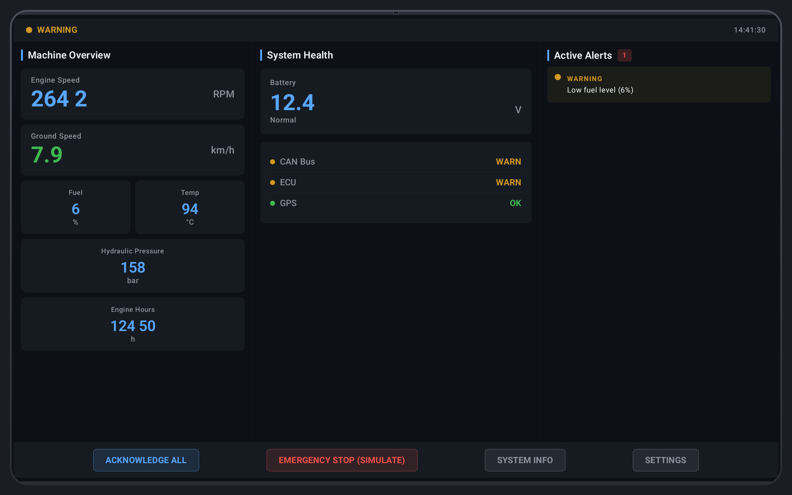
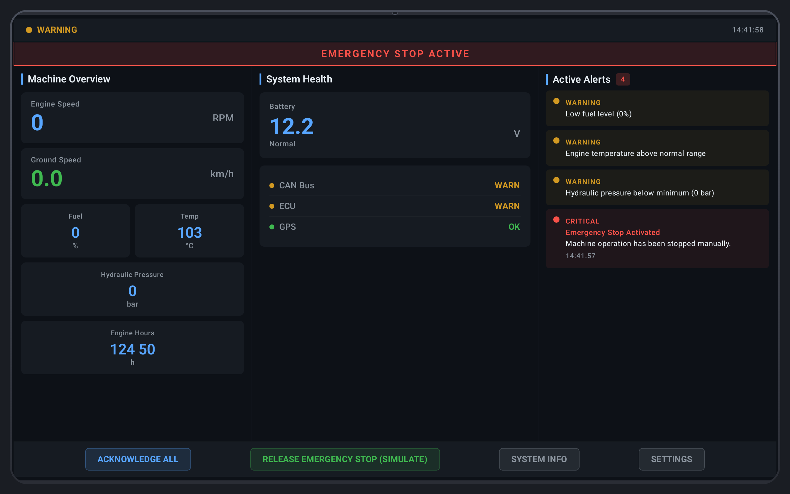

# MachinePilot

[](https://kotlinlang.org)
[](https://developer.android.com/jetpack/compose)
[](https://developer.android.com/studio/releases/platforms)
[](LICENSE)

Industrial HMI simulator for Android — real-time telemetry, diagnostics, and alerts on a simulated machine dashboard.

<!--  -->

## Features

- **Live Telemetry** — simulated CAN bus data: RPM, speed, fuel, engine temp, hydraulic pressure
- **GPS & Battery** — location tracking and battery health monitoring
- **Health Diagnostics** — real-time analysis with severity-graded alerts (INFO / WARNING / CRITICAL)
- **Emergency Stop** — simulated emergency stop with state overlay and banner
- **Industrial HMI UI** — dark theme, gauge cards, system health panel, active alerts list with Material 3

## Architecture

```
:app ───────────────────────────────────────────────── :machine-sdk
 │                                                      │
 ├── feature/dashboard                                  │
 │   ├── DashboardScreen.kt         UI composables      │
 │   ├── DashboardViewModel.kt      state container      │
 │   ├── DashboardContract.kt       state/action defs    │
 │   └── Extensions.kt              formatting helpers   │
 │                                                      │
 ├── domain                                             │
 │   ├── model/                  Alert, Telemetry, etc.  │
 │   ├── repository/             MachineRepository       │
 │   └── analyzer/               MachineAnalyzer         │
 │                                                      │
 ├── data                                               │
 │   ├── repository/             MachineRepositoryImpl   │
 │   ├── mapper/                 TelemetryMapper         │
 │   └── di/                     Hilt DataModule         │
 │                                                      │
 └── designsystem                                       │
     └── theme/                 Color, Theme, Typography │
                                                      │
                                         ┌──────────────────────┐
                                         │  MachineClient        │
                                         │  (interface)          │
                                         ├──────────────────────┤
                                         │  FakeMachineClient    │
                                         │  - CAN simulation     │
                                         │  - GPS simulation     │
                                         │  - Battery simulation │
                                         └──────────────────────┘
```

### Data Flow

```
FakeMachineClient ──Flow──▶ MachineRepositoryImpl ──Flow──▶ DashboardViewModel ──State──▶ DashboardScreen
      │                                                       │
      │  emergencyStop()                                      │  onAction()
      └──────────────────▶ MachineRepository ◄────────────────┘
```

## Tech Stack

| Layer | Technology |
|-------|-----------|
| UI | Jetpack Compose + Material 3 |
| Architecture | MVI (State / Action / Event) |
| DI | Hilt |
| Async | Kotlin Coroutines + Flow |
| SDK | Kotlin Multiplatform‑ready module (`:machine-sdk`) |
| Compile SDK | 37 (Android 15) |
| Min SDK | 26 |

## Project Structure

```
MachinePilot/
├── app/                          # Main application module
│   └── src/main/java/.../machinepilot/
│       ├── data/                 # Repository impl, mappers, DI
│       ├── domain/               # Models, repository interfaces, analyzer
│       ├── designsystem/theme/   # Color, typography, theme
│       └── feature/dashboard/    # MVI screen
├── machine-sdk/                  # Standalone SDK library (pure Kotlin)
│   └── src/main/kotlin/.../sdk/
│       ├── MachineClient.kt      # Client interface
│       ├── FakeMachineClient.kt  # Simulated implementation
│       └── MachineTelemetry.kt   # SDK data models
└── gradle/libs.versions.toml     # Version catalog
```

## Screenshots

<!--
  Add screenshots to docs/screenshots/ and uncomment these:

  
  
  
-->

| Dashboard | Emergency Stop | Alerts |
|-----------|---------------|--------|
| `docs/screenshots/dashboard.png` | `docs/screenshots/emergency_stop.png` | `docs/screenshots/alerts.png` |

## Getting Started

```bash
# Clone
git clone https://github.com/fziraki/MachinePilot.git

# Open in Android Studio — sync Gradle, then run on API 26+ device/emulator
```

No API keys or backend setup required. All telemetry is fake in-memory.

## License

MIT — see [LICENSE](LICENSE).
